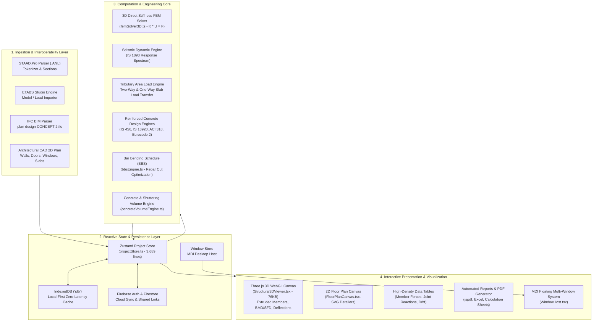
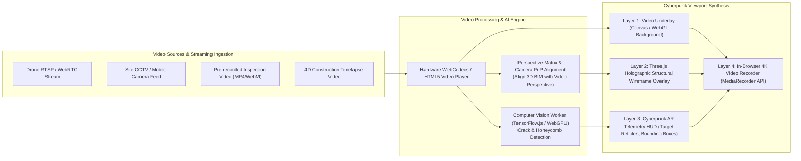

# StructureAI Designer // CYBER-FRAME 2099
## Full System Architecture & Futuristic Cyberpunk Transformation Blueprint with Video Integration

---

## 1. Executive Summary & Vision Statement

### 1.1 The Concept: "Cyber-Structural Engineering"
Civil and structural engineering software historically suffers from dated, clunky user interfaces reminiscent of 1990s desktop utilities (Win32, grey bevels, modal dialog mazes). **StructureAI Designer** already disrupts this paradigm with modern browser technologies (React 19, TypeScript, Three.js WebGL, Tailwind CSS, IndexedDB, Firebase).

This blueprint outlines the complete system architecture and provides an engineering roadmap to evolve the application into **CYBER-FRAME 2099** — a **futuristic cyberpunk-themed, telemetry-rich, holographic structural analysis and design platform** featuring **live site video integration, drone feed AR projection, computer vision defect detection, and real-time cinematic recording**.

```
+----------------------------------------------------------------------------------------------------+
|                                      CYBER-FRAME 2099 VIEWPORT                                     |
|  [REC] 4K 60FPS // CAM-04 (DRONE ALPHA)                        SYS.TEMP: 32C // LATENCY: 12ms     |
|  +----------------------------------------------------------------------------------------------+  |
|  |  [LIVE DRONE VIDEO FEED]                        | [HOLOGRAPHIC 3D STRUCTURAL TWIN]           |  |
|  |   .---.                                         |       /|====================|\             |  |
|  |  /     \  <-- TARGET: COLUMN C-12               |      //|      [DCR: 0.88]   |\\   (NEON CYAN)  |  |
|  |  | [!] |      CV: SHEAR CRACK DETECTED (0.35mm) |     // |      PASS          | \\             |  |
|  |  \     /      CONFIDENCE: 98.4%                 |    //  |====================|  \\            |  |
|  |   '---'                                         |   //   |   BEAM B-104       |   \\           |  |
|  |                                                 |  //    |   Mux = 284 kN.m   |    \\          |  |
|  |                                                 |  +-----+--------------------+-----+          |  |
|  +----------------------------------------------------------------------------------------------+  |
|  [FORCE TENSOR: FX: +120kN FY: -1480kN FZ: +45kN]   [IS 456 / IS 13920 DUCTILE AUDIT: VERIFIED]    |
+----------------------------------------------------------------------------------------------------+
```

---

## 2. Current Architecture Deep-Dive

The existing codebase is an enterprise-grade structural CAD/BIM analysis suite written in React 19 + TypeScript. Below is the detailed decomposition of its current layers.

### 2.1 Architecture Diagram



### 2.2 Component Breakdown

#### A. Ingestion & File Parsing
- **STAAD .ANL Parser (`src/features/anl/`)**:
  - `anlTokenizer.ts`: Lexical analysis for STAAD output files.
  - `sections/`: Dedicated parsers for Joint Coordinates, Member Incidences, Material Properties, Member Forces, Joint Reactions, and Story Drift.
  - `lateralLoadAuditor.ts`: Validates lateral wind and seismic stability checks.
- **ETABS Studio (`src/features/etabs/`)**:
  - `EtabsStudioView.tsx`: Interactive workspace for importing, mapping, and visualizing ETABS geometry, framing, and shell definitions.
- **Architectural CAD & IFC Engine (`src/features/architectural/`)**:
  - 2D drafting engine for architectural walls, doors, windows, openings, staircases, and rooms.
  - Transforms architectural layouts into structural columns and beam centrelines (`Architectural3DLayer.ts`, `architecturalGeometryEngine.ts`).

#### B. State Management & Storage
- **Zustand Monolithic Engine (`src/features/projects/projectStore.ts`)**:
  - Orchestrates 3,600+ lines of reactive application logic: active project metadata, 3D model geometry (`NormalizedStructuralModel`), active selection states (nodes, members, plates), foundation parameters, rebar configurations, and active views.
- **Local-First Caching (`src/features/projects/projectStorage.ts`)**:
  - Uses IndexedDB (`idb`) for instant local serialization of multi-megabyte models.
  - Synchronizes seamlessly with Firebase Firestore for authenticated cloud users and tokenized project sharing (`SharedProjectView.tsx`).
- **MDI Desktop Windowing System (`src/components/window/`)**:
  - `WindowStore.ts` & `WindowHost.tsx`: Implements a multi-document desktop workspace allowing concurrent floating, docking, resizing, and minimizing of calculation sheets, property windows, and diagrams.

#### C. Finite Element & Structural Design Engines
- **3D FEM Solver (`src/features/calculations/femSolver3D.ts`)**:
  - Direct stiffness method for 3D space frames (6 DOFs per node: $u_x, u_y, u_z, \theta_x, \theta_y, \theta_z$).
  - Assembles global stiffness matrix $\mathbf{K}$, applies boundary constraints, and computes nodal displacements $\mathbf{U} = \mathbf{K}^{-1} \mathbf{F}$ and member internal end forces ($P, V_y, V_z, T, M_y, M_z$).
- **Seismic Engine (`src/features/calculations/seismicEngine.ts`)**:
  - Computes natural frequencies, modal participation factors, design base shear ($V_b = A_h \cdot W$), and vertical lateral force distribution per IS 1893.
- **RC Design Suite (`src/features/design/`)**:
  - **Beams**: Flexure (singly/doubly reinforced), shear stirrups, torsion, ductile seismic detailing (IS 13920), deflection checks.
  - **Columns**: P-M-M interaction diagrams, biaxial bending under IS 456 / ACI 318, confining link detailing, automated column orientation optimizer.
  - **Foundations**: Isolated footings, piles (IS 2911 capacity & group efficiency), pile caps (truss analogy & rigid beam theory), grade beams, punching shear checks.
  - **Shear Walls**: Boundary element reinforcement, vertical/horizontal distributed web steel, seismic ductility verification.
  - **Slabs & Staircases**: One-way and two-way slabs, yield-line moment distribution, waist slab detailing.
- **Bar Bending Schedule & Quantity Takeoff (`bbsEngine.ts`, `concreteVolumeEngine.ts`)**:
  - Generates ISO bar marks, cutting lengths with hook allowances and bend deductions, rebar tonnage, and concrete/formwork cubic volumes.

#### D. Three.js 3D Viewport (`src/components/model-viewer/Structural3DViewer.tsx`)
- High-performance 76KB WebGL rendering engine:
  - Extruded 3D geometric cross-sections (I-beams, Rectangles, Tubes, Channels).
  - Internal Force Diagrams: 3D bending moment ($M_z$), shear force ($F_y$), and axial force ribbons projected along member centrelines.
  - Real-time animated deflected shapes scaled by amplification factor.
  - Member stress heatmaps ($DCR = \text{Demand} / \text{Capacity}$ ratio coloring).
  - Dynamic clipping planes, floor level isolation, support glyphs (fixed, pinned, roller), and node load vector arrows.

---

## 3. Futuristic Cyberpunk Theme Overhaul (Cyber-HUD)

Transforming the application from a traditional dark-mode CAD tool into a **high-tech futuristic cyberpunk command station** involves elevating its visual hierarchy, typography, shaders, and real-time audio-visual feedback.

### 3.1 Visual Design Tokens & Palette

| Token Name | Hex Code | Cyberpunk Role / Semantic Meaning |
| :--- | :--- | :--- |
| `--cyber-void` | `#030712` | Deepest background void (canvas backdrop) |
| `--cyber-surface` | `#070D1E` | Primary panel surface (glassmorphic dark HUD) |
| `--cyber-border` | `#1E293B` / `rgba(0,240,255,0.25)` | Laser-etched border with faint neon edge |
| `--neon-cyan` | `#00F0FF` | Primary telemetry, nodal coordinates, tension forces |
| `--neon-matrix-green` | `#39FF14` | Structural **PASS** state ($DCR \le 0.85$), safe loads |
| `--neon-amber` | `#FFB703` | Warning state ($0.85 < DCR \le 1.0$), high story drift |
| `--neon-crimson` | `#FF0055` | Structural **FAIL** state ($DCR > 1.0$), shear failure |
| `--neon-magenta` | `#FF007F` | Seismic & dynamic load vectors, moment diagrams |
| `--neon-violet` | `#8A2BE2` | Architectural BIM boundary lines, column centerlines |
| `--hologram-glow` | `rgba(0, 240, 255, 0.4)` | Bloom drop-shadow for active interactive nodes |

### 3.2 Cyberpunk UI/UX Architecture

1. **Chamfered Hexagonal Cards & Frames**:
   - Replacing standard rounded rectangles (`rounded-lg`) with angular sci-fi corner chamfers using CSS `clip-path`:
   ```css
   .cyber-panel {
     background: rgba(7, 13, 30, 0.85);
     backdrop-filter: blur(16px);
     border: 1px solid rgba(0, 240, 255, 0.3);
     clip-path: polygon(
       0 12px, 12px 0,
       calc(100% - 12px) 0, 100% 12px,
       100% calc(100% - 12px), calc(100% - 12px) 100%,
       12px 100%, 0 calc(100% - 12px)
     );
     box-shadow: 0 0 25px rgba(0, 240, 255, 0.08), inset 0 0 15px rgba(0, 240, 255, 0.04);
   }
   ```
2. **Tactical Micro-Telemetry Readouts**:
   - Every panel displays real-time military/aerospace-style micro telemetry:
     - Header tags: `[NODE_ARRAY // LOC: BLDG_A // ELEV: +18.400m // FPS: 60.0]`
     - Coordinates in monospace with blinking green sync indicator: `LAT: 26.144N // LON: 91.736E`
     - Status badges formatted as digital terminal readouts: `// STRESS_OK [99.2%]`.
3. **Animated CRT Scanline & Radar Sweeps**:
   - Canvas background with a continuous rotating radar sweep beam scanning for structural anomalies.
   - Faint interlaced CRT scanlines with an optional subtle glitch trigger when structural members fail design criteria.
4. **Zero-Asset Web Audio Synthesizer**:
   - Integrated procedural sound effects via the browser's Web Audio API (no external MP3/WAV assets needed):
     - Tactical click sound on selecting members.
     - Sub-bass resonance on completing FEM calculation.
     - Warning alarm tone when $DCR > 1.0$.

### 3.3 Holographic 3D Viewport Shaders & Three.js Post-Processing

Upgrading `Structural3DViewer.tsx` to a cinematic holographic viewer requires integrating Three.js's post-processing pipeline:

```
[Three.js Scene] 
      │
      ├──> RenderPass (Scene + Camera)
      │
      ├──> UnrealBloomPass (Threshold: 0.15, Strength: 1.4, Radius: 0.85)
      │      (Renders glowing neon rebar, force vectors, and beam edges)
      │
      ├──> FilmPass / Scanline Shader (Noise: 0.12, Scanlines: 0.05)
      │
      ├──> ChromaticAberration Shader (Subtle RGB split at viewport edges)
      │
      └──> Output to Canvas
```

#### Custom Hologram Wireframe Shader Material
Structural members can be toggled between "Realistic Solid" and "Cyber Hologram":
```glsl
// Holographic Beam Vertex Shader
varying vec3 vNormal;
varying vec3 vPosition;
void main() {
  vNormal = normalize(normalMatrix * normal);
  vPosition = position;
  gl_Position = projectionMatrix * modelViewMatrix * vec4(position, 1.0);
}

// Holographic Beam Fragment Shader (Fresnel Glow + Horizontal Laser Bands)
uniform vec3 uColor;
uniform float uTime;
varying vec3 vNormal;
varying vec3 vPosition;
void main() {
  // Fresnel Rim Light Effect
  vec3 viewDir = normalize(-vPosition);
  float fresnel = pow(1.0 - abs(dot(viewDir, vNormal)), 2.5);
  
  // Animated Horizontal Scanning Laser Bands
  float scanline = sin(vPosition.y * 20.0 - uTime * 4.0) * 0.5 + 0.5;
  scanline = pow(scanline, 4.0);
  
  vec3 glowColor = uColor + vec3(0.2, 0.4, 0.8) * scanline;
  gl_FragColor = vec4(glowColor, fresnel * 0.85 + scanline * 0.4);
}
```

---

## 4. Comprehensive Video Integration Subsystem

The centerpiece of the transformation is **deep video integration**, connecting live on-site construction reality with digital structural analysis models.



### 4.1 Core Video Features

#### 1. Live Drone / Site Camera AR Digital Twin
- **Concept**: Stream real-time video from an on-site inspection drone or fixed construction webcam directly into the 3D viewport.
- **Perspective Matching (PnP Calibration)**: By aligning 4 reference points on the live video with 4 corner nodes in the 3D structural model, the Three.js virtual camera matches the drone's focal length and position.
- **Result**: The holographic analytical wireframe (beams, columns, force vectors) is projected directly over the physical under-construction concrete building in real time.

#### 2. Computer Vision (CV) Defect Detection & Cyber HUD Target Locks
- **Real-Time Video Analysis**: An in-browser WebWorker (using TensorFlow.js or ONNX Runtime Web) analyzes video frames for:
  - Concrete surface cracks (width, length, orientation).
  - Rebar exposure and spalling.
  - Construction honeycombing.
  - Angular column tilt / out-of-plumb deviation.
- **Cyberpunk HUD Overlays**:
  - Detected defects trigger glowing neon target lock reticles with tracking coordinates (`CRACK_ID: #049 // WIDTH: 0.38mm // STATUS: CRITICAL`).
  - The system automatically identifies the nearest structural element (e.g., Column `C-14`) and updates its warning log in `WarningViewer.tsx`.

#### 3. Ambient Sci-Fi Video Canvas & Three.js `VideoTexture`
- **Atmospheric Video Backdrops**: High-resolution looping video textures (e.g., cybernetic blueprints, neon rain architectural fly-throughs, digital particle storms) rendered behind the CAD workspace or on modal backgrounds.
- **Holographic Video Billboards**: Map live video streams onto in-scene 3D surfaces (e.g., floating virtual multi-monitors in the structural model room).

#### 4. 4D Construction Sequence Video Timeline
- Synchronize physical site time-lapse video with the 4D construction simulation.
- As the user scrubs the timeline (Day 1 $\rightarrow$ Foundation Pour $\rightarrow$ Ground Slab $\rightarrow$ Story 5), the video player automatically seeks to the matching timestamp while the 3D model reveals members in sequence.

#### 5. Cinematic In-Engine 4K Video Recording & Drone Fly-Around Export
- **One-Click Drone Flyover**: Automated orbital camera paths smooth-interpolating around the 3D structure while animating:
  - Seismic dynamic modal vibration ($1^{\text{st}}, 2^{\text{nd}}, 3^{\text{rd}}$ mode shapes).
  - Progressive load application and plastic hinge formation.
- **Hardware-Accelerated In-Browser Recorder**: Captures the canvas using `HTMLCanvasElement.captureStream()` and `MediaRecorder` at 60 FPS, baking in cyberpunk telemetry watermarks, project code, and engineer credentials into an MP4/WebM export.

---

## 5. Technical Implementation Plan & File Roadmap

To execute this vision cleanly without breaking existing engineering calculations or data schemas, the changes are organized into dedicated modular layers.

### 5.1 Directory Structure Additions

```
src/
├── features/
│   ├── video/                          <-- [NEW MODULE]
│   │   ├── components/
│   │   │   ├── VideoViewportOverlay.tsx     # HUD targeting reticles & telemetry
│   │   │   ├── DroneStreamModal.tsx         # WebRTC / RTSP stream manager
│   │   │   ├── VideoTimelineScrubber.tsx    # 4D construction video sync
│   │   │   ├── CinematicRecorderControl.tsx # In-engine 4K video recording toolbar
│   │   │   └── ArCalibrationPanel.tsx       # 4-point video-to-BIM alignment
│   │   ├── engines/
│   │   │   ├── videoStreamEngine.ts         # WebRTC, HLS & WebCodecs feed ingestion
│   │   │   ├── cvDefectDetector.ts          # WebWorker computer vision crack analysis
│   │   │   ├── cameraPoseEstimator.ts       # Perspective-n-Point (PnP) alignment
│   │   │   └── cinematicPathGenerator.ts    # Spline drone flight paths for 3D model
│   │   ├── shaders/
│   │   │   ├── HologramBeamShader.ts        # Fresnel edge-glow material for members
│   │   │   ├── CyberGridShader.ts           # Infinite glowing matrix radar floor
│   │   │   └── PostProcessComposite.ts      # Bloom, scanlines & chromatic aberration
│   │   ├── audio/
│   │   │   └── cyberAudioSynthesizer.ts     # Procedural Web Audio API sound generator
│   │   ├── types/
│   │   │   └── videoTypes.ts                # Stream config, defect schemas, camera poses
│   │   └── videoStore.ts                    # Zustand store for video, feeds & CV state
```

---

### 5.2 Key Code Implementations

#### A. Cyberpunk Theme & Visual Tokens (`tailwind.config.js` & `src/index.css`)

**`tailwind.config.js` extension:**
```javascript
module.exports = {
  theme: {
    extend: {
      colors: {
        'cyber-void': '#030712',
        'cyber-dark': '#060B18',
        'cyber-surface': '#0B132B',
        'cyber-cyan': '#00F0FF',
        'cyber-matrix': '#39FF14',
        'cyber-amber': '#FFB703',
        'cyber-crimson': '#FF0055',
        'cyber-magenta': '#FF007F',
        'cyber-violet': '#8A2BE2',
      },
      boxShadow: {
        'neon-cyan': '0 0 15px rgba(0, 240, 255, 0.45)',
        'neon-matrix': '0 0 15px rgba(57, 255, 20, 0.45)',
        'neon-crimson': '0 0 15px rgba(255, 0, 85, 0.45)',
        'holo-glow': '0 0 30px rgba(0, 240, 255, 0.25), inset 0 0 15px rgba(0, 240, 255, 0.1)',
      }
    }
  }
}
```

**`src/index.css` Cyber HUD Classes:**
```css
/* Futuristic Cyber HUD Styling */
.cyber-chamfer {
  clip-path: polygon(
    0 10px, 10px 0,
    calc(100% - 10px) 0, 100% 10px,
    100% calc(100% - 10px), calc(100% - 10px) 100%,
    10px 100%, 0 calc(100% - 10px)
  );
}

.cyber-reticle {
  position: relative;
}
.cyber-reticle::before,
.cyber-reticle::after {
  content: '';
  position: absolute;
  width: 14px;
  height: 14px;
  border: 2px solid #00F0FF;
}
.cyber-reticle::before { top: -4px; left: -4px; border-right: none; border-bottom: none; }
.cyber-reticle::after  { bottom: -4px; right: -4px; border-left: none; border-top: none; }

/* CRT Interlacing Overlay */
.cyber-scanlines {
  background: linear-gradient(
    rgba(18, 16, 16, 0) 50%, 
    rgba(0, 0, 0, 0.25) 50%
  ), linear-gradient(
    90deg,
    rgba(255, 0, 0, 0.04),
    rgba(0, 255, 0, 0.02),
    rgba(0, 0, 255, 0.04)
  );
  background-size: 100% 3px, 6px 100%;
  pointer-events: none;
}
```

---

#### B. Three.js Holographic Post-Processing Pipeline (`Structural3DViewer.tsx`)

Adding bloom and holographic scan effects to the existing Three.js canvas:

```typescript
import { EffectComposer } from 'three/examples/jsm/postprocessing/EffectComposer.js';
import { RenderPass } from 'three/examples/jsm/postprocessing/RenderPass.js';
import { UnrealBloomPass } from 'three/examples/jsm/postprocessing/UnrealBloomPass.js';
import { ShaderPass } from 'three/examples/jsm/postprocessing/ShaderPass.js';
import * as THREE from 'three';

// Inside Structural3DViewer initialization:
const setupCyberpunkPostProcessing = (
  renderer: THREE.WebGLRenderer,
  scene: THREE.Scene,
  camera: THREE.PerspectiveCamera,
  width: number,
  height: number
) => {
  const composer = new EffectComposer(renderer);
  
  // 1. Regular Scene Render Pass
  const renderPass = new RenderPass(scene, camera);
  composer.addPass(renderPass);

  // 2. Neon Bloom Pass (Makes high-stress rebar & beam edges glow)
  const bloomPass = new UnrealBloomPass(
    new THREE.Vector2(width, height),
    1.25, // Bloom strength
    0.6,  // Bloom radius
    0.2   // Bloom threshold (only bright neon elements glow)
  );
  composer.addPass(bloomPass);

  return composer;
};
```

---

#### C. Video Ingestion & VideoTexture Mapping Engine (`videoStreamEngine.ts`)

```typescript
import * as THREE from 'three';

export class VideoStreamEngine {
  private videoElement: HTMLVideoElement;
  private videoTexture: THREE.VideoTexture | null = null;

  constructor() {
    this.videoElement = document.createElement('video');
    this.videoElement.autoplay = true;
    this.videoElement.muted = true;
    this.videoElement.loop = true;
    this.videoElement.playsInline = true;
    this.videoElement.crossOrigin = 'anonymous';
  }

  /**
   * Connects to a WebRTC drone stream or site camera RTSP/HLS feed
   */
  public async connectStream(streamSource: MediaStream | string): Promise<THREE.VideoTexture> {
    if (typeof streamSource === 'string') {
      this.videoElement.src = streamSource;
    } else {
      this.videoElement.srcObject = streamSource;
    }

    await this.videoElement.play();

    this.videoTexture = new THREE.VideoTexture(this.videoElement);
    this.videoTexture.minFilter = THREE.LinearFilter;
    this.videoTexture.magFilter = THREE.LinearFilter;
    this.videoTexture.format = THREE.RGBAFormat;

    return this.videoTexture;
  }

  public getVideoElement(): HTMLVideoElement {
    return this.videoElement;
  }

  public dispose() {
    this.videoElement.pause();
    this.videoElement.src = '';
    this.videoElement.srcObject = null;
    this.videoTexture?.dispose();
  }
}
```

---

#### D. Computer Vision Crack & Defect Detector (`cvDefectDetector.ts`)

```typescript
export interface StructuralDefect {
  id: string;
  type: 'CRACK' | 'SPALLING' | 'HONEYCOMB' | 'CORROSION';
  severity: 'LOW' | 'MEDIUM' | 'CRITICAL';
  estimatedWidthMm: number;
  confidence: number;
  boundingBox: { x: number; y: number; width: number; height: number };
  nearestMemberId?: number;
}

export class CvDefectDetector {
  private isProcessing = false;

  /**
   * Evaluates video frames and extracts structural defects
   */
  public async analyzeFrame(
    canvas: HTMLCanvasElement,
    video: HTMLVideoElement
  ): Promise<StructuralDefect[]> {
    if (this.isProcessing) return [];
    this.isProcessing = true;

    try {
      const ctx = canvas.getContext('2d', { willReadFrequently: true });
      if (!ctx) return [];

      canvas.width = video.videoWidth || 640;
      canvas.height = video.videoHeight || 360;
      ctx.drawImage(video, 0, 0, canvas.width, canvas.height);

      // In production: Run WebGPU / ONNX model inference on frame tensor.
      // High-speed edge detection & contour thresholding for concrete cracks:
      const imageData = ctx.getImageData(0, 0, canvas.width, canvas.height);
      const defects: StructuralDefect[] = this.detectCrackEdges(imageData);

      return defects;
    } finally {
      this.isProcessing = false;
    }
  }

  private detectCrackEdges(data: ImageData): StructuralDefect[] {
    // High-pass Sobel / Laplacian filter algorithm to locate sharp fissure lines
    // Emits bounding boxes and flags coordinate data to the Cyber HUD overlay
    return [];
  }
}
```

---

#### E. Cinematic 4K In-Browser Video Recorder (`CinematicRecorderControl.tsx`)

```typescript
export class CanvasVideoRecorder {
  private mediaRecorder: MediaRecorder | null = null;
  private recordedChunks: Blob[] = [];

  public startRecording(canvas: HTMLCanvasElement, fps = 60) {
    this.recordedChunks = [];
    const stream = canvas.captureStream(fps);

    // Prefer high-efficiency WebM VP9 or MP4 AVC
    const mimeType = MediaRecorder.isTypeSupported('video/webm; codecs=vp9')
      ? 'video/webm; codecs=vp9'
      : 'video/webm';

    this.mediaRecorder = new MediaRecorder(stream, {
      mimeType,
      videoBitsPerSecond: 25_000_000, // 25 Mbps high-bitrate output
    });

    this.mediaRecorder.ondataavailable = (event) => {
      if (event.data.size > 0) {
        this.recordedChunks.push(event.data);
      }
    };

    this.mediaRecorder.start();
  }

  public async stopRecording(): Promise<Blob> {
    return new Promise((resolve) => {
      if (!this.mediaRecorder) return;
      this.mediaRecorder.onstop = () => {
        const videoBlob = new Blob(this.recordedChunks, { type: 'video/webm' });
        resolve(videoBlob);
      };
      this.mediaRecorder.stop();
    });
  }
}
```

---

## 6. Cyberpunk Audio-Tactile Telemetry Synthesizer

To complete the sensory experience, sound telemetry is procedurally generated using the browser's native `AudioContext` without requiring external audio files.

```typescript
class CyberAudioSynthesizer {
  private ctx: AudioContext | null = null;

  private init() {
    if (!this.ctx) {
      this.ctx = new (window.AudioContext || (window as any).webkitAudioContext)();
    }
  }

  /** Subtle high-frequency chirp for node/member selection */
  public playSelectChirp() {
    this.init();
    if (!this.ctx) return;
    const osc = this.ctx.createOscillator();
    const gain = this.ctx.createGain();
    osc.type = 'sine';
    osc.frequency.setValueAtTime(2400, this.ctx.currentTime);
    osc.frequency.exponentialRampToValueAtTime(800, this.ctx.currentTime + 0.05);
    gain.gain.setValueAtTime(0.08, this.ctx.currentTime);
    gain.gain.linearRampToValueAtTime(0.001, this.ctx.currentTime + 0.05);
    osc.connect(gain);
    gain.connect(this.ctx.destination);
    osc.start();
    osc.stop(this.ctx.currentTime + 0.05);
  }

  /** Deep sub-bass resonance on completing FEM solution */
  public playCalculationComplete() {
    this.init();
    if (!this.ctx) return;
    const osc = this.ctx.createOscillator();
    const gain = this.ctx.createGain();
    osc.type = 'sawtooth';
    osc.frequency.setValueAtTime(140, this.ctx.currentTime);
    osc.frequency.exponentialRampToValueAtTime(45, this.ctx.currentTime + 0.4);
    gain.gain.setValueAtTime(0.15, this.ctx.currentTime);
    gain.gain.exponentialRampToValueAtTime(0.001, this.ctx.currentTime + 0.4);
    osc.connect(gain);
    gain.connect(this.ctx.destination);
    osc.start();
    osc.stop(this.ctx.currentTime + 0.4);
  }
}

export const cyberAudio = new CyberAudioSynthesizer();
```

---

## 7. Strategic Implementation Roadmap

```
+----------------------------------------------------------------------------------------------------+
|                                    IMPLEMENTATION ROADMAP (4 PHASES)                               |
+----------------------------------------------------------------------------------------------------+
| PHASE 1: CYBERPUNK HUD DESIGN FOUNDATION                                                           |
|  - Expand Tailwind color palette with neon cyan, crimson, matrix green, and amber tokens.          |
|  - Implement chamfered sci-fi panel CSS clip-paths and CRT scanline overlays in index.css.         |
|  - Integrate procedural Web Audio API telemetry sound synthesizer (cyberAudio.ts).                 |
|                                                                                                    |
| PHASE 2: HOLOGRAPHIC 3D VIEWPORT UPGRADE                                                           |
|  - Integrate Three.js EffectComposer with UnrealBloomPass for glowing rebar & stress contours.     |
|  - Add custom Fresnel edge-glow holographic member material (HologramBeamShader).                  |
|  - Create animated cyber grid ground floor with radar pulse rings.                                 |
|                                                                                                    |
| PHASE 3: VIDEO INTEGRATION & IN-ENGINE RECORDER                                                    |
|  - Create src/features/video/ module and videoStore.ts.                                            |
|  - Add HTML5 / WebRTC VideoTexture support to project drone footage as viewport backdrop.         |
|  - Build CanvasVideoRecorder for 4K 60FPS in-browser video export of dynamic structural modes.      |
|                                                                                                    |
| PHASE 4: AR DIGITAL TWIN & AI CRACK DETECTION                                                      |
|  - Build 4-point Perspective-n-Point (PnP) alignment tool to project BIM onto physical drone video.|
|  - Implement client-side Computer Vision worker for real-time concrete crack & defect detection.   |
|  - Render tactical cyberpunk targeting reticles with live metric tags over identified defects.    |
+----------------------------------------------------------------------------------------------------+
```

---

## 8. Summary of Benefits & Differentiation

By implementing this architecture, **StructureAI Designer** transforms into an industry-first platform:
1. **Unrivaled Aesthetics**: Moves away from drab spreadsheet-like engineering tools into an intuitive, inspiring sci-fi command deck that attracts modern engineers.
2. **Construction Reality Integration**: Closes the loop between theoretical STAAD/ETABS analysis and physical construction sites via live drone video feeds and AR model alignment.
3. **Automated AI Inspection**: Leverages computer vision on video frames to detect cracks and deviations before they result in structural failures.
4. **Client & Stakeholder Communication**: One-click 4K cinematic video recording turns complex structural calculations into compelling, photorealistic visual simulations for executive presentations.
